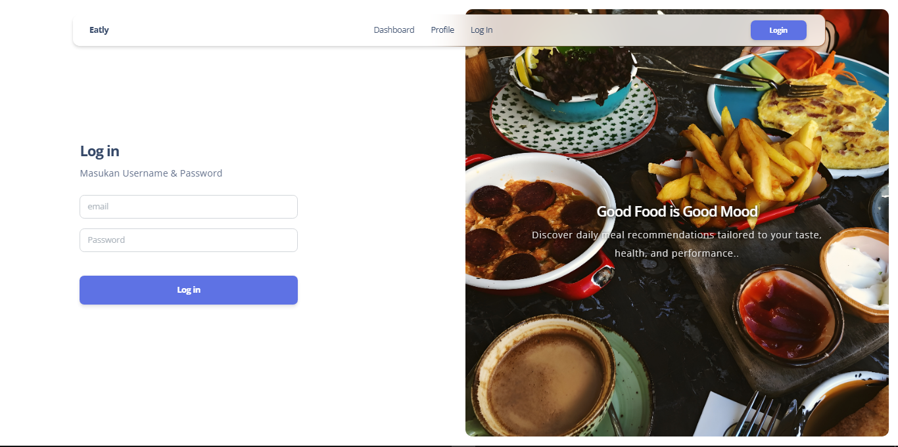
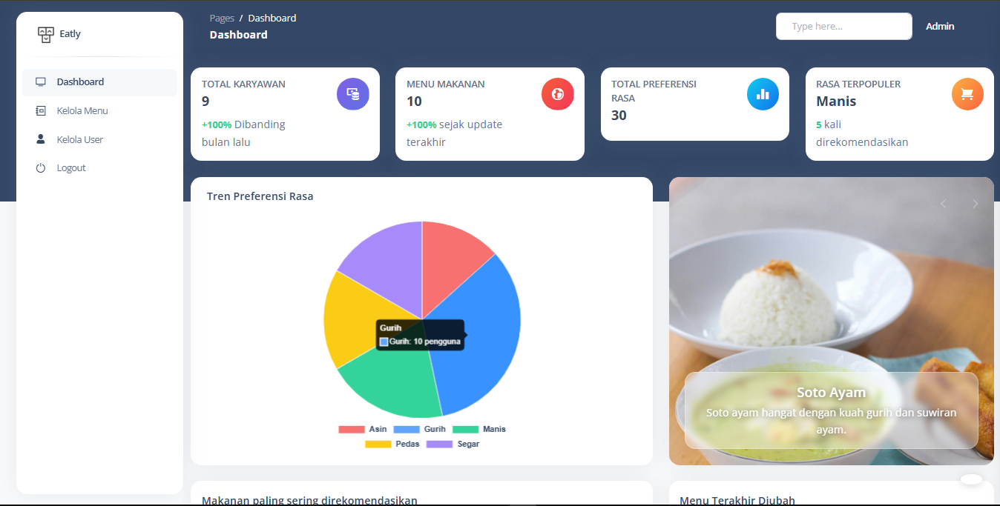
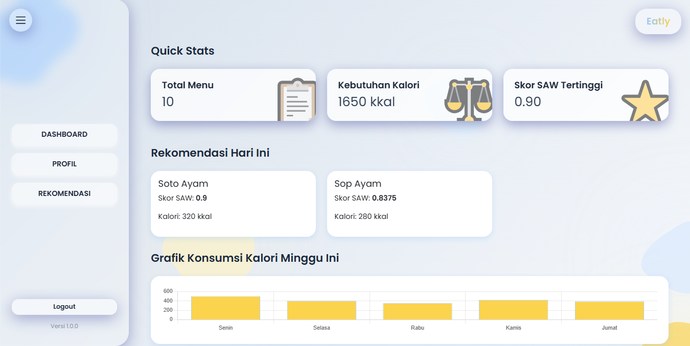
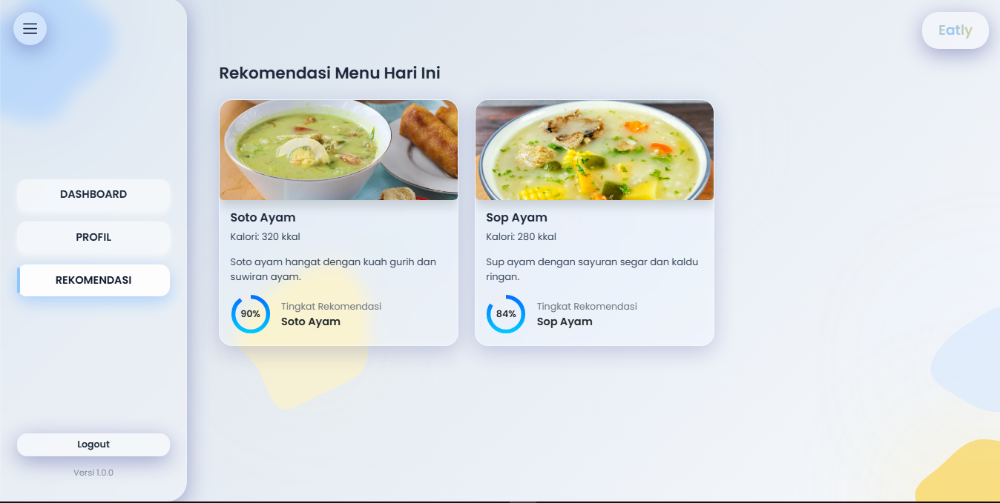

# Eatly – Healthy Food Recommendation Web App

Eatly is a web-based healthy food recommendation system built using Laravel.  
This application helps users find daily meal recommendations based on their calorie needs and preferences.

## 📸 Application Preview

### 🔐 Login Page

### 🛠 Admin Dashboard

### 👤 User Dashboard

### 🙍 User Profile

### 🤖 Recommendation Result

## 🚀 Features
- User authentication (Login & Register)
- Daily food menu management
- Healthy food recommendation system
- CRUD Menu (Admin)
- Role-based access control
- Modal-based detail view
- Profile image upload

## 🧠 Recommendation Logic
The system uses a simplified calorie calculation:
Calorie Needs = Body Weight (kg) × 30

The result is used as an initial filter before applying further recommendation logic.

## 🛠 Tech Stack
- Laravel
- PHP
- MySQL
- Bootstrap
- JavaScript
- Glassmorphism UI Design

## 🧪 Testing
End-to-end and automation testing implemented separately using Playwright:
👉 See: eatly-qa-automation repository

## ⚙️ Installation
1. Clone the repository
2. Run `composer install`
3. Setup `.env`
4. Run `php artisan migrate`
5. Run `php artisan serve`

## 👨‍💻 Author
Developed as part of a final project and extended as a portfolio system.